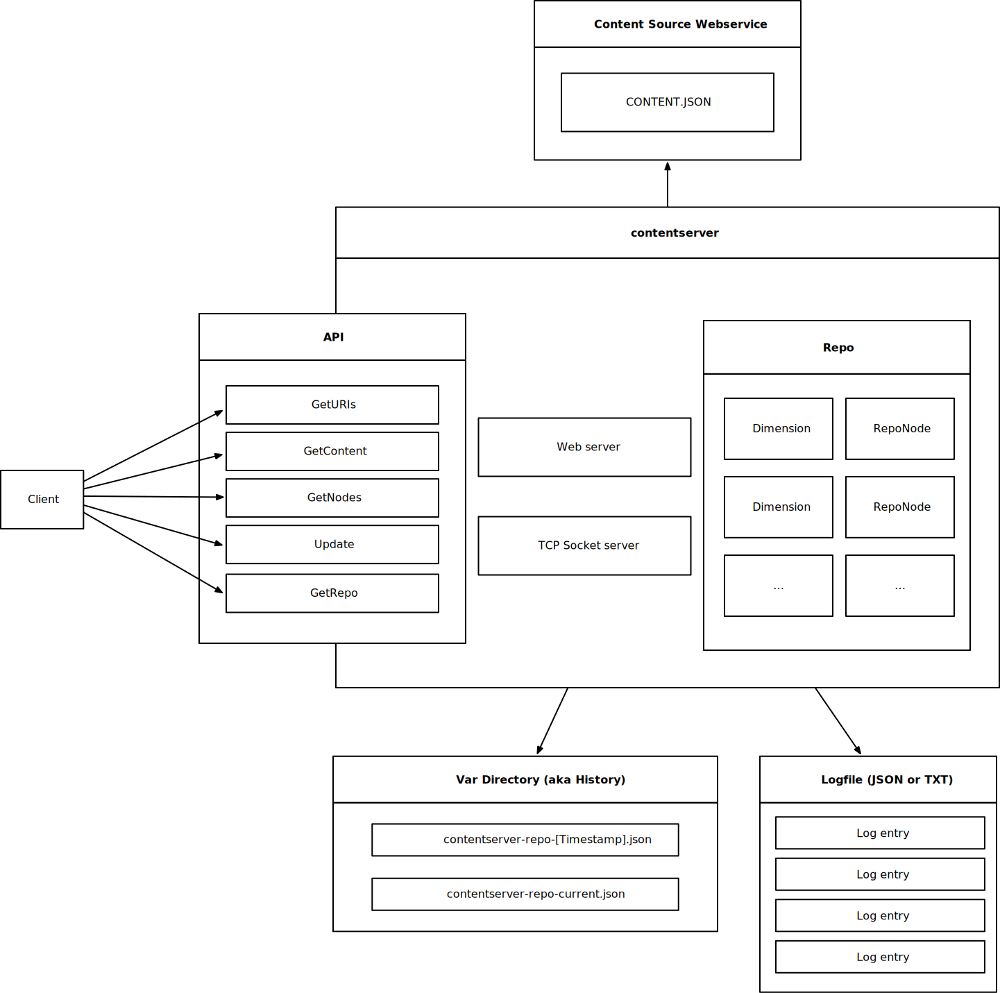
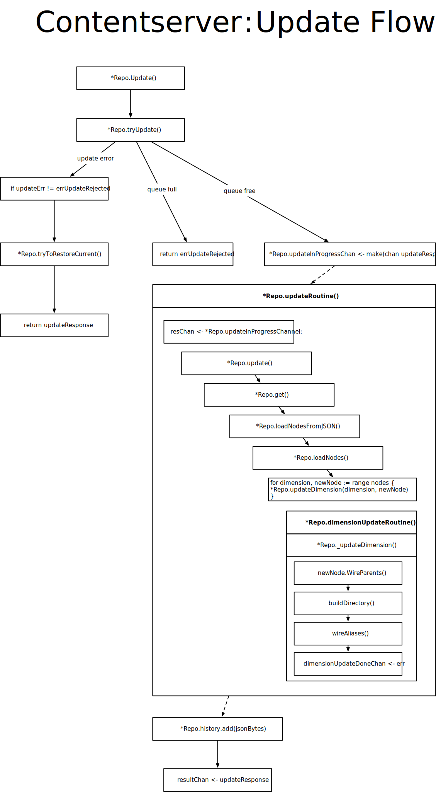

[](https://github.com/foomo/contentserver/actions/workflows/pr.yml)
[](https://goreportcard.com/report/github.com/foomo/contentserver)
[](https://coveralls.io/github/foomo/contentserver?branch=main)
[](https://godoc.org/github.com/foomo/contentserver)

<p align="center">
  
</p>

# Content Server

Serves content tree structures very quickly.

## Concept

A Server written in GoLang to mix and resolve content from different content sources, e.g. CMS, Blog, Shop and many
other more. The server provides a simple to use API for non blocking content repository updates, to resolve site content
by an URI or to get deep-linking multilingual URIs for a given contentID.

It's up to you how you use it and which data you want to export to the server. Our intention was to write a fast and
cache hazzle-free content server to mix different content sources.

### Overview



## Export Data

All you have to do is to provide a tree of content nodes as a JSON encoded RepoNode.

| Attribute     |          Type          |                                                 Usage |
|---------------|:----------------------:|------------------------------------------------------:|
| Id            |         string         |                        unique id to identify the node |
| MimeType      |         string         | mime-type of the node, e.g. text/html, image/png, ... |
| LinkId        |         string         |                 (symbolic) link/alias to another node |
| Groups        |        []string        |                                        access control |
| URI           |         string         |                                                   URI |
| Name          |         string         |                                                  name |
| Hidden        |          bool          |                                          hide in menu |
| DestinationId |         string         |                              alias / symlink handling |
| Data          | map[string]interface{} |                                          payload data |
| Nodes         |  map[string]*RepoNode  |                                           child nodes |
| Index         |        []string        |                        contains the order of of nodes |

### Tips

- If you do not want to build a multi-market website define a generic market, e.g. call it *universe*
- keep it lean and do not export content which should not be accessible at all, e.g. you are working on a super secret
  fancy new category of your website
- Hidden nodes can be resolved by their uri, but are hidden on nodes
- To avoid duplicate content provide a DestinationId ( = ContentId of the node you want to reference) instead of URIs

## Request Data

There is a PHP Proxy implementation for foomo in [Foomo.ContentServer](https://github.com/foomo/Foomo.ContentServer).
Feel free to use it or to implement your own proxy in the language you love. The API should be easily to implement in
every other framework and language, too.

## Update Flowchart



### Usage

```bash
$ contentserver -h
Serves content tree structures very quickly

Usage:
  contentserver [command]

Available Commands:
  completion  Generate the autocompletion script for the specified shell
  help        Help about any command
  http        Start http server
  socket      Start socket server
  version     Print version information

Flags:
  -h, --help                help for contentserver
      --log-format string   log format (default "json")
      --log-level string    log level (default "info")

Use "contentserver [command] --help" for more information about a command.
```

## Storage Backends

The content server supports pluggable storage backends for persisting repository snapshots.

### Filesystem (Default)

By default, the server stores snapshots on the local filesystem:

```bash
contentserver http --history-dir /var/lib/contentserver http://example.com/repo.json
```

### Blob Storage (Cloud)

For cloud deployments, blob storage supports multiple providers via URL schemes:

#### Google Cloud Storage

```bash
contentserver http \
  --storage-type blob \
  --storage-blob-bucket gs://my-bucket \
  --storage-blob-prefix contentserver/snapshots/ \
  http://example.com/repo.json
```

Uses Application Default Credentials (ADC) for authentication.

#### AWS S3

```bash
contentserver http \
  --storage-type blob \
  --storage-blob-bucket "s3://my-bucket?region=us-east-1" \
  --storage-blob-prefix contentserver/snapshots/ \
  http://example.com/repo.json
```

Uses AWS SDK v2 default credential chain (environment variables, shared credentials file, IAM role).

#### Azure Blob Storage

```bash
contentserver http \
  --storage-type blob \
  --storage-blob-bucket azblob://my-container \
  --storage-blob-prefix contentserver/snapshots/ \
  http://example.com/repo.json
```

Uses Azure SDK default credential chain (environment variables, managed identity).

### Environment Variables

| Variable | Description |
|----------|-------------|
| `CONTENT_SERVER_STORAGE_TYPE` | Storage type: `filesystem` (default) or `blob` |
| `CONTENT_SERVER_STORAGE_BLOB_BUCKET` | Blob storage URL with scheme (gs://, s3://, azblob://) |
| `CONTENT_SERVER_STORAGE_BLOB_PREFIX` | Object key prefix |

See [gocloud.dev/blob](https://gocloud.dev/howto/blob/) for detailed authentication configuration.

## How to Contribute

Please refer to the [CONTRIBUTING](.github/CONTRIBUTING.md) details and follow the [CODE_OF_CONDUCT](.github/CODE_OF_CONDUCT.md) and [SECURITY](.github/SECURITY.md) guidelines.

## License

Distributed under LGPL 3.0 License, please see license file within the code for more details.

_Made with ♥ [foomo](https://www.foomo.org) by [bestbytes](https://www.bestbytes.com)_
